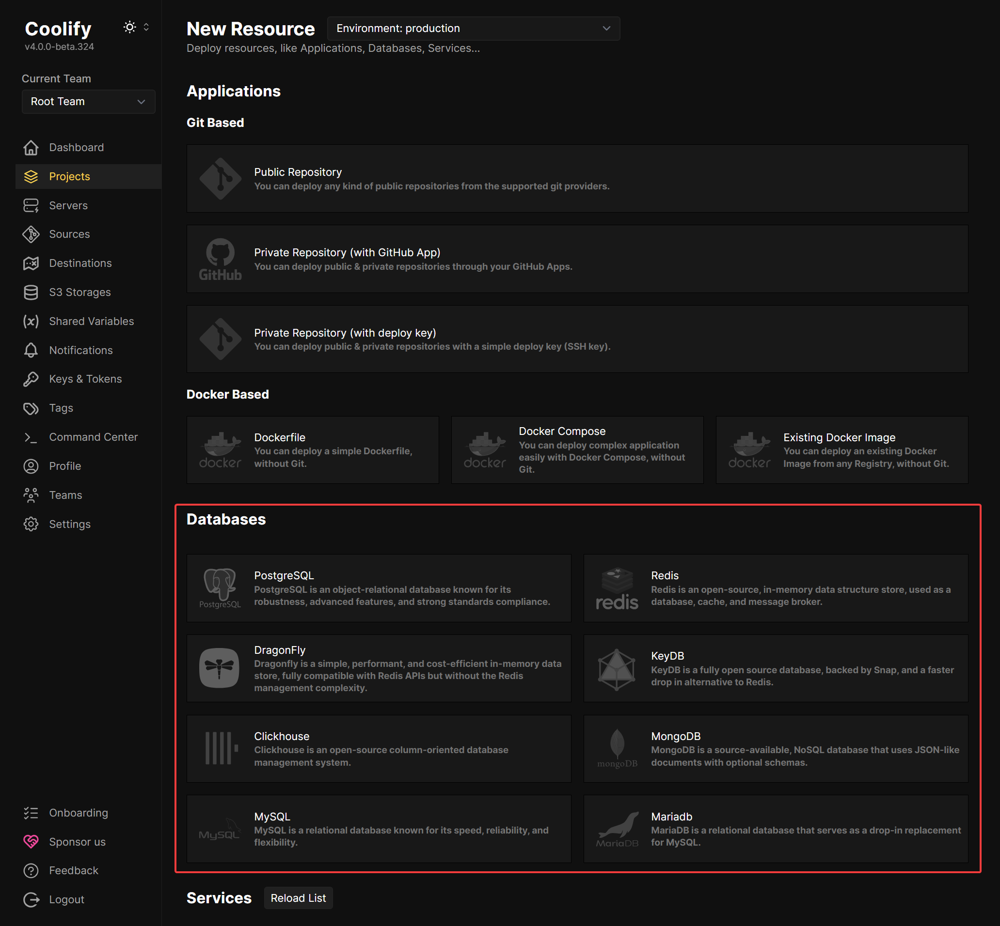

import { Aside } from '@astrojs/starlight/components';

Coolify supports a variety of databases to suit different application needs. Even if you don't see your favorite database here, you can still host it with Coolify, using Docker.

Coolify offers one-click setup for the following databases:

- [PostgreSQL](/docs/databases/postgresql)
- [Redis](/docs/databases/redis)
- [DragonFly](/docs/databases/dragonfly)
- [KeyDB](/docs/databases/keydb)
- [Clickhouse](/docs/databases/clickhouse)
- [MongoDB](/docs/databases/mongodb)
- [MySQL](/docs/databases/mysql)
- [MariaDB](/docs/databases/mariadb)

Each database has its own strengths and use cases. Click on a database to learn more about it.

# Deploy a database

When selecting a New Resource, you can select a database from the list.

You can configure a database with a simple click. Coolify supports the following databases:

- PostgreSQL
- MySQL
- MariaDB
- MongoDB
- Redis
- DragonFly
- KeyDB
- Clickhouse

## Ports Mapping vs Public Port

### Ports Mapping

Ports mapping is using the Docker [port mapping](https://docs.docker.com/network/#published-ports) feature. It is used to map the container port to the host port. For example, if you set the port mapping to `8080:80`, the container port `80` will be mapped to the host port `8080`.

You can also map port to a specific ip address.

For example, if you want to map the port 8080 to the ip address `192.168.1.100`, you can do it like this: `192.168.1.100:8080:80`.

### Public Port

Public port is used to expose the container port to the internet, by starting an Nginx TCP proxy.

### Which one should I use?

- Port mappings makes the connection/port permanent (you need to restart your database to change it).
- The public port makes the connection/port dynamic (you can change it without restarting the database, Coolify will restart the Nginx TCP proxy for you).
