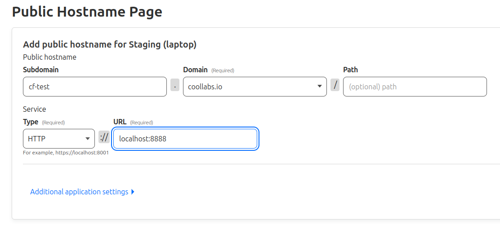
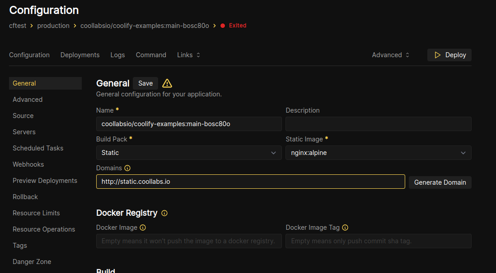
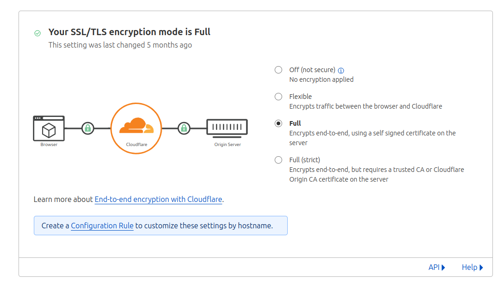

import { Aside, Steps, TabItem, Tabs } from '@astrojs/starlight/components';

You can run Coolify on your local machine (like old laptop/Raspberry PI) and expose it to the internet without opening any ports on your router with Cloudflare Tunnels.

> For more details about CF Tunnels, please visit [this page](https://developers.cloudflare.com/cloudflare-one/connections/connect-networks/).

## Setup Cloudflared

You have at least two ways to setup Cloudflare Tunnels with Coolify.

- [Automated](#automated)
- [Manual](#manual)

### Automated

<Steps>
1. Setup Tunnels on Cloudflare
    1. Go to `https://one.dash.cloudflare.com/`.

    2. Select your account.

    3. Open `Networks`-> `Tunnels`-> `Create a Tunnel`

    4. Connector: `Cloudflared`
    

    5. Choose any name you like.
    

    6. Copy your `Cloudflare Tunnel Token` from any of the commands.
    <Aside type="caution">
    The token starts with `eyJ...`.
    </Aside>

    

    7. On the `Route Tunnel` tab, add the following tunnels:

    <Aside type="caution">
    You can use any domains/subdomains. This will make sure you can reach your server through Cloudflare Tunnels.
    </Aside>

    

  2. Setup Remote Management

      There are two ways to manage your new Coolify server:
        - Connect to an existing Coolify server
        - Use the built-in dashboard
      
      If you already have a Coolify server which has its dashboard exposed to the internet, or are a Coolify cloud customer, use the first option. Otherwise, use the second option.

      <Tabs>
        <TabItem label="Connect to an Existing Server">
          This will allow you to manage your new Coolify server from an existing Coolify server.
        <Steps>
        1. Add a new server with your server's `IP Address` - it will be reconfigured later on.
            

            2. Validate the server.

            2. After the server is validated, click on `Configure` in the `Cloudflare Tunnels` section.

            3. Paste `Cloudflare Tunnel Token` from the previous step and set the `SSH Domain` to the domain you set in the previous step.
            
        </Steps>
      </TabItem>

      <TabItem label="Use the Built-in Dashboard">

        This will expose this servers dashboard to the internet.

        If using a [wildcard domain](#wildcard-subdomain---all-resources), you can skip this section.

        

        <Steps>
  
              1. For [one domain -> one resource](#one-domain---one-resource) setup, add these domains to Cloudflare Tunnels:
                 | Domain                    | Maps To                 |
                 | ------------------------- | ----------------------- |
                 | `app.yourdomain.com`      | `http://localhost:8000` |
                 | `realtime.yourdomain.com` | `http://localhost:6001` |
                 | `terminal.yourdomain.com` | `http://localhost:6002` |
              
                  <Aside type="caution">
                        If using a firewall, allow the [required ports](/docs/knowledge-base/server/firewall).
                  </Aside>


              3. Add these environment variables to `/data/coolify/source/.env`:
                  ```bash
                  # ...
                  PUSHER_HOST=realtime.yourdomain.com
                  PUSHER_PORT=443
                  TERMINAL_HOST=terminal.yourdomain.com
                  ```

              4. Restart Coolify:
                  ```bash
                  curl -fsSL https://cdn.coollabs.io/coolify/install.sh | bash
                  ```

              5. To verify the realtime server:
                  1. Navigate to your Coolify instance, as in the example: `https://app.yourdomain.io`.
                  2. Login with the root user (the first user you created after installation).
                  3. Open another tab/window and navigate to `https://app.yourdomain.io/realtime`. On the other tab (opened in point 2), you should see a notification about the test event.
                  4. If you know what are you doing, you can check the network tab as well. Search for a websocket connection.
        </Steps>
      </TabItem>
      </Tabs>
</Steps>

### Manual

WIP

## Setup Resources in Coolify

You have several options to use Cloudflare Tunnels with Coolify.

1. One domain -> One resource.
2. Wildcard subdomain -> All resources.

### One domain -> One resource

In this case, you need to add a public domain every time you would like to expose a new resource through Cloudflare Tunnels.

<Aside type="caution">
  You can stop `Coolify Proxy` and set it to `None`, it is not needed in this
  case.
</Aside>

1. Go to your tunnel settings on Cloudflare. (https://one.dash.cloudflare.com/ -> Networks -> Tunnels -> Select your tunnel)
2. Switch to `Public Hostname` tab.
3. Add a new `Public Hostname`.
   
4. Go to Coolify and to your resource settings: - Remove any `Domains` settings. - Set `Port Mappings` to the same port that you set in the `Public Hostname` settings.
   <Aside type="caution">
     As an example, I'm deploying a static site, that listens in port `80`
     inside the container and I'm mapping it to the port `8888` on the host. So,
     I need to set the `Port Mappings` to `8888:80`.
     
   </Aside>
5. Deploy & enjoy.

### Wildcard subdomain -> All resources

In this case, you only need to setup a wildcard domain once and you can expose all your resources through it.

<Aside type="caution">
  You will need to use `Coolify's Proxy` to route the traffic to the correct
  resource.
</Aside>

1. Go to your tunnel settings on Cloudflare. (https://one.dash.cloudflare.com/ -> Networks -> Tunnels -> Select your tunnel)
2. Switch to `Public Hostname` tab.
3. Add a new wildcard `Public Hostname`.
   
4. In Cloudflare go to ` Networks -> Tunnels` and click on your tunnel name. From the sidebar copy the `Tunnel ID`.
   
5. In Cloudflare go to your `DNS` settings and add a new `CNAME` record with the following settings:
   - `Name`: `*`
   - `Target`: `<Tunnel ID>.cfargotunnel.com`
   - `TTL`: `Auto`
6. Go to Coolify and to your resource settings.

Set the `Domains` to any subdomain of the wildcard domain you set in the previous step.



<Aside type="caution">
You need to use `http://` in the `Domains` settings. Cloudflare will take care of the `https` part.
For this you need to set `SSL/TLS` to `Full` in the `SSL/TLS` menu on Cloudflare.


</Aside>

7. Deploy & enjoy.

<Aside type="caution">
  If you would like to add a new resource, you only need to do point 6 and 7.
</Aside>

### Full HTTPS/TLS Setup (Traefik/Coolify Proxy)

<Aside type="note">
    Before proceeding with the below make sure you have your Cloudflare tunnel
    and domain setup to be working with http and the https redirect as explained
    above. The next steps make modifications so that you can set https in
    Coolify and it works as you would expect.
</Aside>

<Aside type="caution">
    If you are also using a subdomain that points to your Coolify instance that is on the same tunnel you want to configure, make sure you're still able to access your UI through the server IP (`server.ip:PORT` - i.e `192.168.x.x:8000`) before doing these changes.

    The default is port `8000`. If you changed or disabled that port make sure you can access it via the set port, or that port is open again on the server.

    Once you've done the below steps, it won't work for a bit until you set the Coolify instance domain to also be `https://` in the Coolify UI (`Settings -> Instance's Domain`).

</Aside>

The above setup with the redirect from `http -> https` in Cloudflare gets you most the of the way by using their tunnels.

However you'll likely find yourself having some issues with some services where the domain name is configured as an environment variable as a http url in a service and then fails because the urls mismatch due to the automatic redirect.

This becomes particularly important with some services when you first try to set them up and configure them.

Authentication services such as [Logto](/docs/services/logto) are affected where the JWT token issuer is different from the callback url, this makes initial setup of the service impossible, unless a alternative URL is provided to the compose somehow.

The best way to be able to solve this would be to be able to set `https://` on the domains for your services, or within your [wildcard domain](/docs/knowledge-base/server/introduction#wildcard-domain) to always be https in Coolify.

If you've tried this, you may have run into the issue where you get caught in a redirect loop.

To set up Coolify wildcard domains so that you can set `https://` in the url for services etc. Then you'll need to do and configure the following things:

<Steps>

1. Create a new origin certificate in Cloudflare for the domain you want to set it up for (`*.yourdomain.com`, `yourdomain.com`).

2. Add it to the origin server and configure the Traefik proxy to use the newly created certificate (see [custom-ssl-certs](/docs/knowledge-base/traefik/custom-ssl-certs) on how to get them on your server). You can add this configuration through the UI if you like. We called it `cert.yaml`.

    ```yaml
    tls:
        certificates:
            - certFile: /traefik/certs/yourdomain.com.cert
              keyFile: /traefik/certs/yourdomain.com.key
    ```

3. Set SSL/TLS encryption mode to full (strict) in Cloudflare.

4. Configure the tunnel to use `https` and then in the tunnel `Additional application settings -> TLS` set the Origin Server Name to be the root domain you want it to be (i.e - `yourdomain.com`)

    <Aside type="tip">
        You need to set the dropdown to be `https` before the TLS option appears
        in the "Additional application settings" area
    </Aside>

5. Set "Always Use HTTPS" in Cloudflare (`managing your domain -> SSL/TLS -> Edge Certificates`).

6. Set a `https` domain name on any service in Coolify as a subdomain of the domain name we just setup - i.e `https://myproject.yourdomain.com`.

</Steps>

If configured correctly all of your traffic to any of the subdomains will now work on `https` as the FQDN in the UI and when visiting in a browser.

## Post Setup

After everything is setup, you can fully disable direct access to your server by disabling all the ports (except `SSH (port:22 by default)`) on your firewall.


