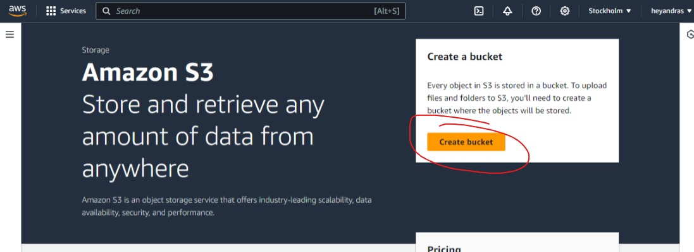
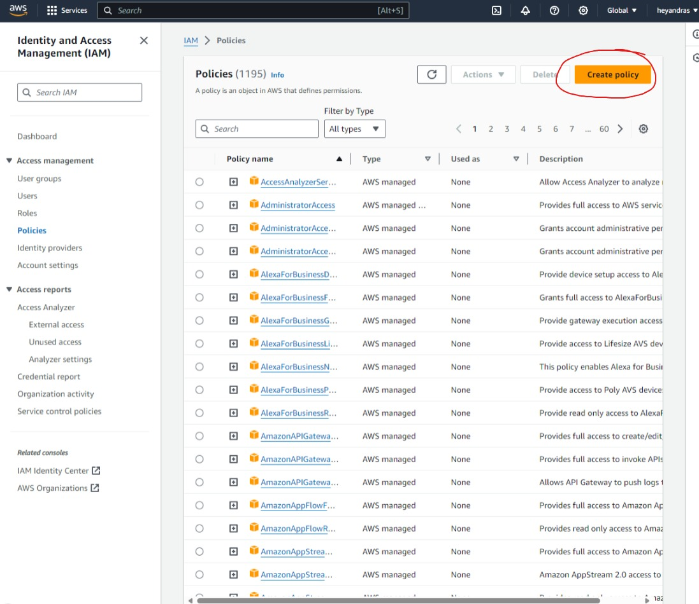
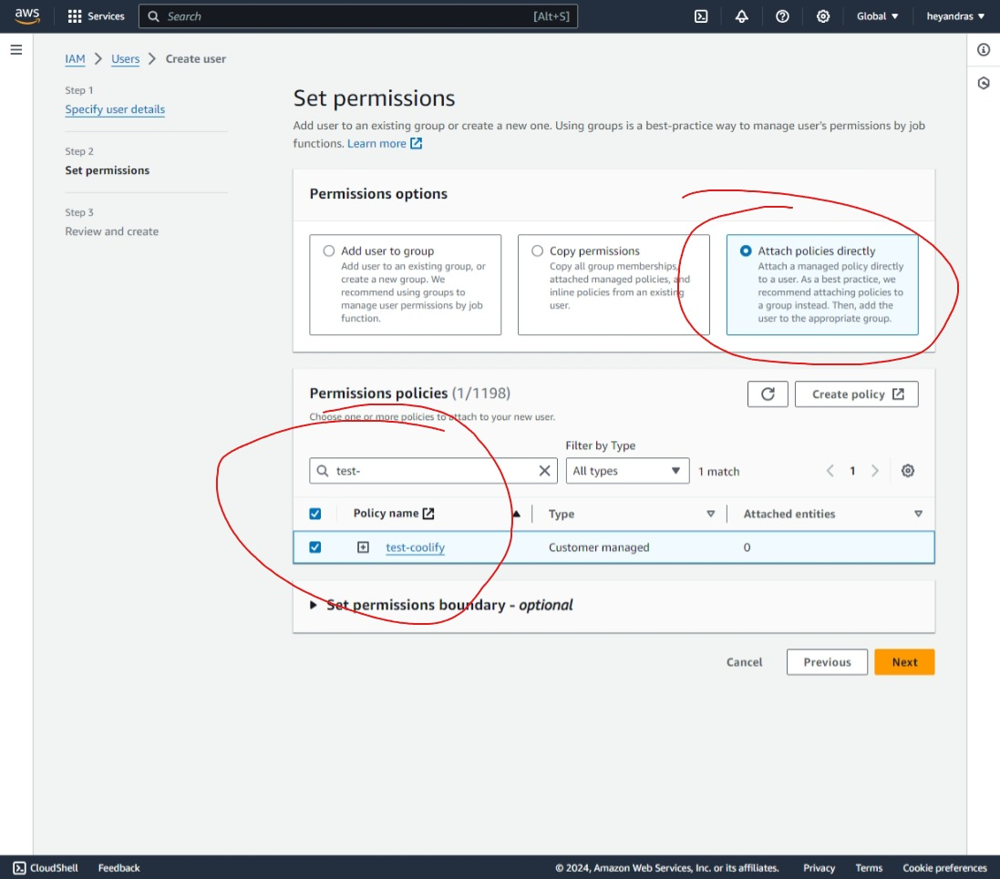
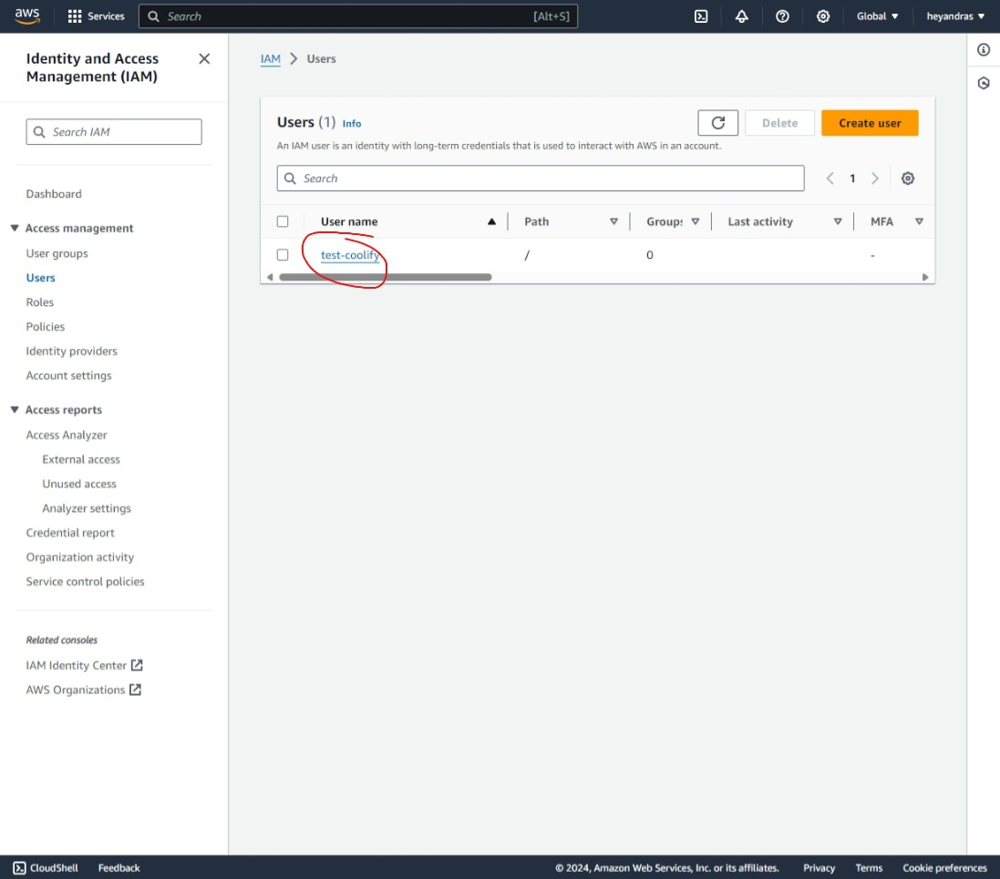
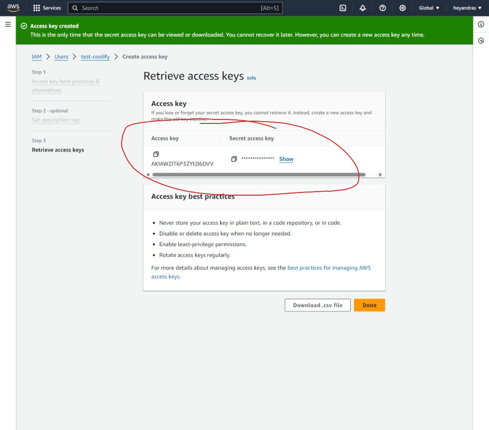
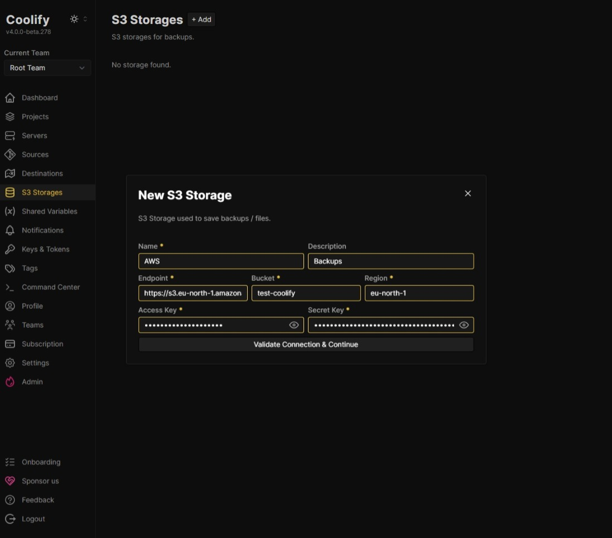

import { Aside, Steps } from '@astrojs/starlight/components';

# TLDR

1. Create a bucket in AWS Console
2. Create a custom policy in AWS Console with the following permissions:

```json
{
  "Version": "2012-10-17",
  "Statement": [
    {
      "Effect": "Allow",
      "Action": [
        "s3:ListBucket",
        "s3:GetObject",
        "s3:DeleteObject",
        "s3:GetObjectAcl",
        "s3:PutObjectAcl",
        "s3:PutObject"
      ],
      "Resource": [
        // rewrite your-bucket-name with your bucket name
        "arn:aws:s3:::your-bucket-name",
        "arn:aws:s3:::your-bucket-name/*"
      ]
    }
  ]
}
```

3. Create an IAM user in AWS Console & attach the policy from the previous step.
4. Go to User settings & create an `Access Key` in AWS Console.
5. Add the `Access Key` and `Secret Key` in Coolify when you create a new S3 source.
   <Aside type="tip">
     You need to use the S3 HTTP endpoint without the bucket name, for example,
     `https://s3.eu-central-1.amazonaws.com`.
   </Aside>

# Detailed steps

### Create a bucket

<Steps>
1. Create a bucket in AWS Console
    Go to [AWS Console](https://us-east-1.console.aws.amazon.com/s3/buckets) and
    create a new bucket. 
2. Name your bucket.
  
</Steps>

### Create a new policy

<Steps>
1. Create a new policy.
    Go to [AWS Console](https://us-east-1.console.aws.amazon.com/iam/home) and create a new policy.
     
2. Name & configure your policy.
    Add the following JSON permissions to your policy (replace `your-bucket-name` with your bucket name):
    ```json
    {
      "Version": "2012-10-17",
      "Statement": [
        {
          "Effect": "Allow",
          "Action": [
            "s3:ListBucket",
            "s3:GetObject",
            "s3:DeleteObject",
            "s3:GetObjectAcl",
            "s3:PutObjectAcl",
            "s3:PutObject"
          ],
          "Resource": [
            "arn:aws:s3:::your-bucket-name",
            "arn:aws:s3:::your-bucket-name/*"
          ]
        }
      ]
    }
    ```
        
        
</Steps>

### Create a new IAM user

<Steps>
1. Create a new IAM User.
    Go to [AWS Console](https://us-east-1.console.aws.amazon.com/iam/home) and
    create a new user. 
2. Name your user.
    
3. Attach the policy created in the previous step.
    
4. Go to your user settings.
    
5. Create a new `Access Key`.
    
7. Copy the `Access Key` & `Secret Access Key`.
    You will need it to configure this S3 storage in Coolify.
    
</Steps>

### Configure S3 in Coolify

<Steps>
1. Add new S3 Storage.
    Go to your Coolify instance and create a new S3 storage.
    
2. Add the details.
    Make sure you use the S3 HTTP endpoint without the bucket name. For example,
    `https://s3.eu-central-1.amazonaws.com`. 
</Steps>

Well done!
