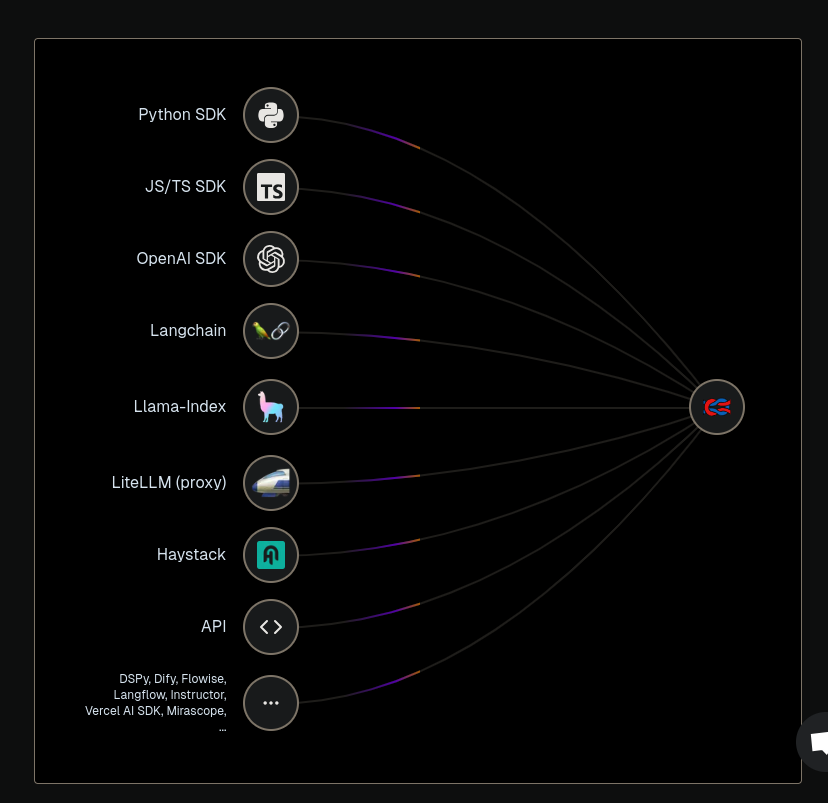

import { Badge } from '@astrojs/starlight/components';

<Badge text="One-click setup." variant="note" size="large" />

## What is Langfuse?

Langfuse is an open-source LLM engineering platform that helps teams collaboratively debug, analyze, and iterate on their LLM applications.

## Screenshots

## Links

- [The official website ›](https://www.langfuse.com/)
