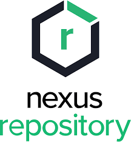
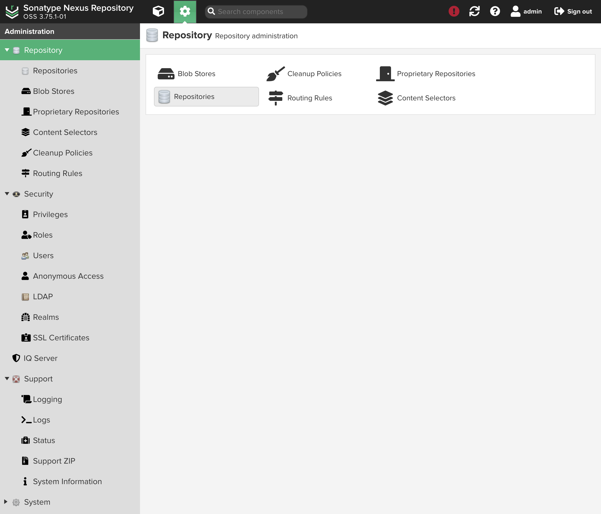
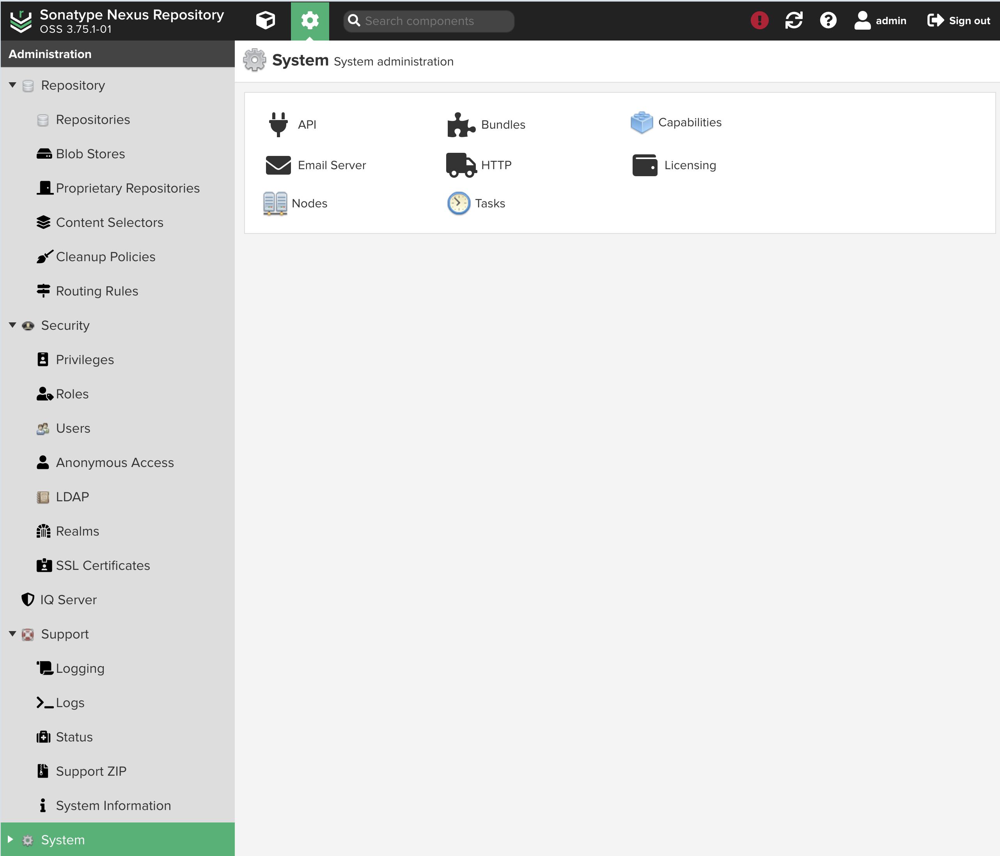

import { Badge } from '@astrojs/starlight/components';

<Badge text="One-click setup." variant="note" size="large" />

## What is Sonatype Nexus

Sonatype Nexus is a repository manager that allows you to store, manage, and distribute your software artifacts.
The official container is for x86_64 architecture. The arm64 version is community maintained and synced with the official repository.

## Setup

- The setup relies on starting as default user "admin" with password "admin123".
- The env variable `NEXUS_ADMIN_PASSWORD` can be used to set a custom password.
- Once the service is running, login with the default credentials and change the password.
- After that, delete `NEXUS_SECURITY_RANDOMPASSWORD=false` line from the compose file and restart the service to apply the changes.

## Screenshots

## Links

- [The official website ›](https://help.sonatype.com/en/sonatype-nexus-repository.html?utm_source=coolify.io)
- [GitHub ›](https://github.com/sonatype/docker-nexus3?utm_source=coolify.io)
