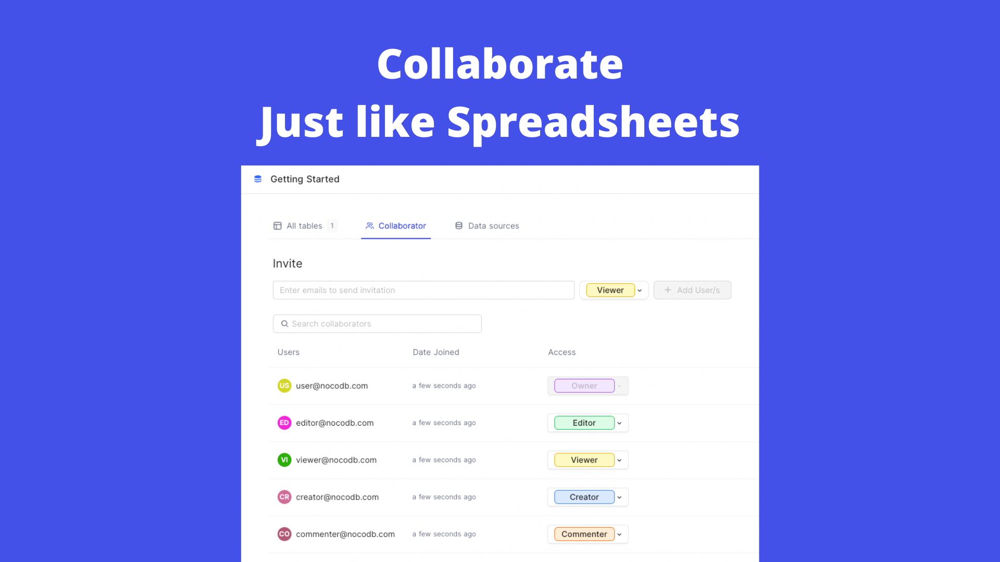
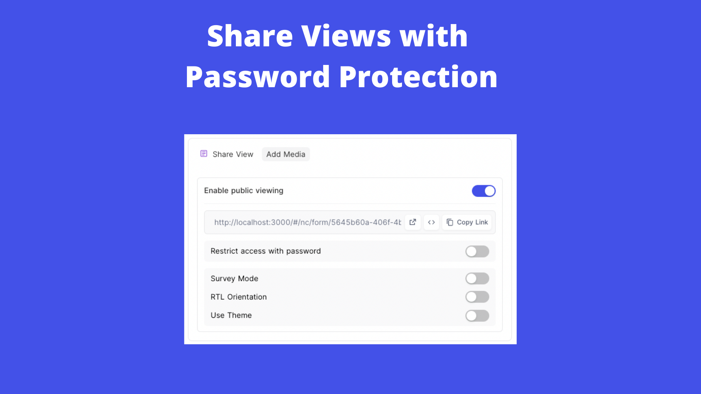
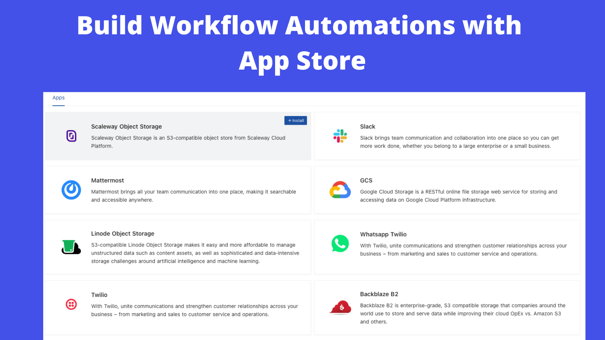
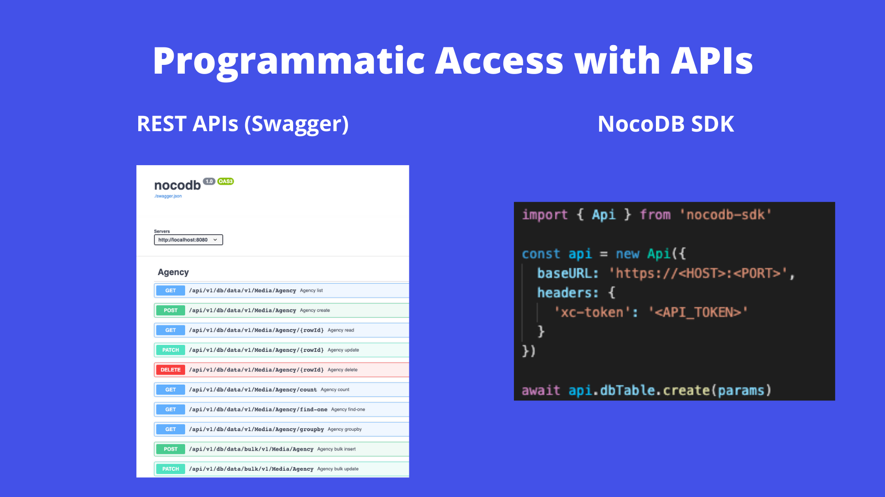
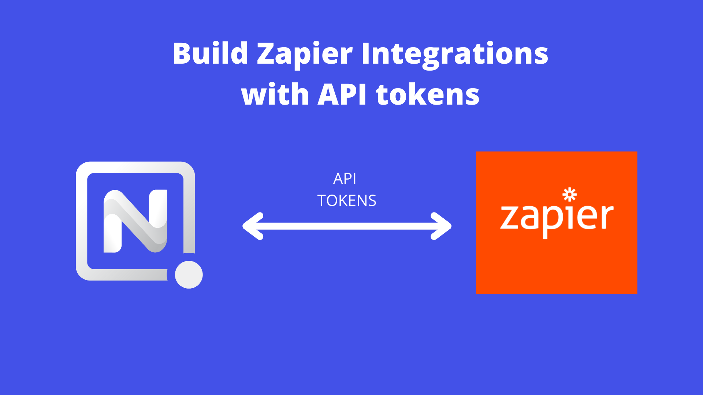

import { Badge } from '@astrojs/starlight/components';

<Badge text="One-click setup." variant="note" size="large" />

## What is NocoDB?

NocoDB is an open source Airtable alternative. Turns any MySQL, PostgreSQL, SQL Server, SQLite & MariaDB into a smart-spreadsheet.

## Screenshots

## Links

- [The official website ›](https://nocodb.com/)
- [GitHub ›](https://github.com/nocodb/nocodb)
