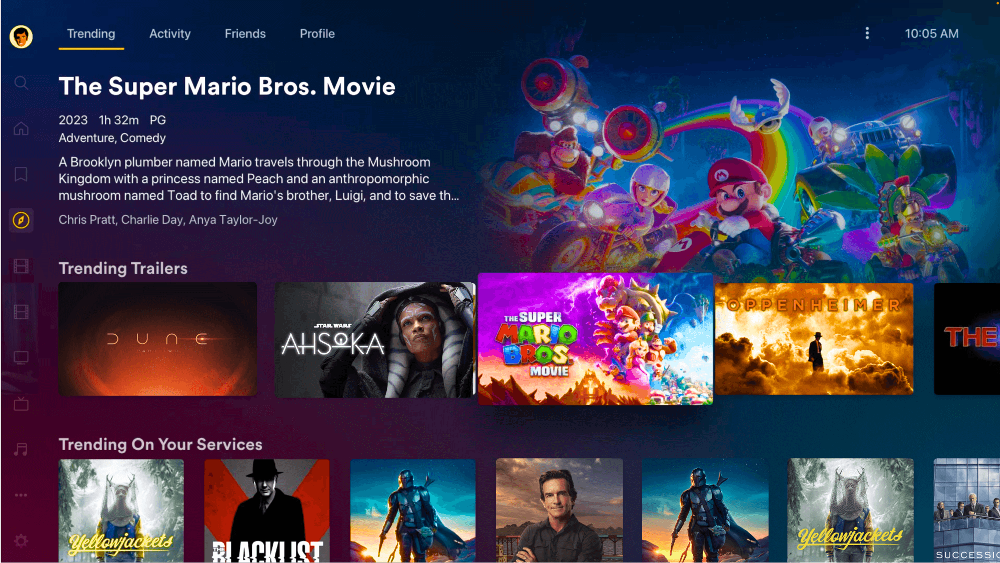

import { Badge } from '@astrojs/starlight/components';

<Badge text="One-click setup." variant="note" size="large" />


## What is Plex?

Available on almost any device, Plex is the first-and-only streaming platform to offer free ad-supported movies, shows, and live TV together.

## Installation

1. Create the service within Coolify.
2. BEFORE starting the service, set the `PLEX_CLAIM` variable. You can get a claim token here: https://plex.tv/claim
3. If your device supports it, enable hardware transcoding by uncommenting this section in the compose file:

```yaml
#devices:
# - "/dev/dri:/dev/dri"
```

## Screenshots



## Links

- [The official website ›](https://www.plex.tv/)
- [GitHub ›](https://github.com/plexinc/pms-docker)
