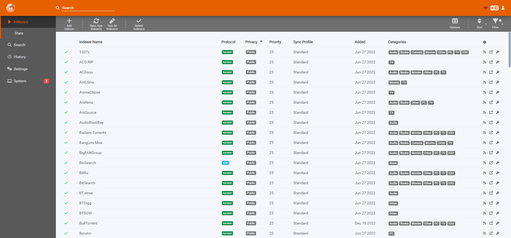

import { Badge } from "@astrojs/starlight/components";

<Badge text="One-click setup." variant="note" size="large" />

## What is Prowlarr?

Prowlarr is an indexer manager/proxy built on the popular \*arr .net/reactjs base stack to integrate with your various PVR apps. Prowlarr supports management of both Torrent Trackers and Usenet Indexers. It integrates seamlessly with Lidarr, Mylar3, Radarr, Readarr, and Sonarr offering complete management of your indexers with no per app Indexer setup required (we do it all).

## Screenshots

## Links

- [The official website ›](https://prowlarr.com/)
- [GitHub ›](https://github.com/Prowlarr/Prowlarr)
