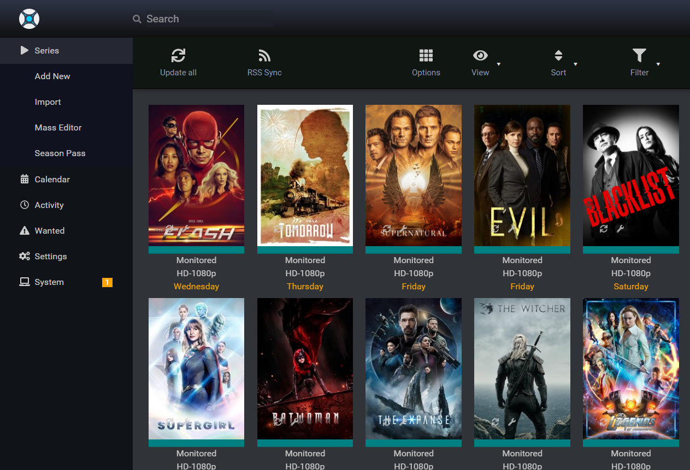

import { Badge } from "@astrojs/starlight/components";

<Badge text="One-click setup." variant="note" size="large" />

## What is Sonarr?

Sonarr is an internet PVR for Usenet and Torrents. Features Calendar See all your upcoming episodes in one convenient location.

## Screenshots

## Links

- [The official website ›](https://sonarr.tv/)
- [GitHub ›](https://github.com/Sonarr/Sonarr)
