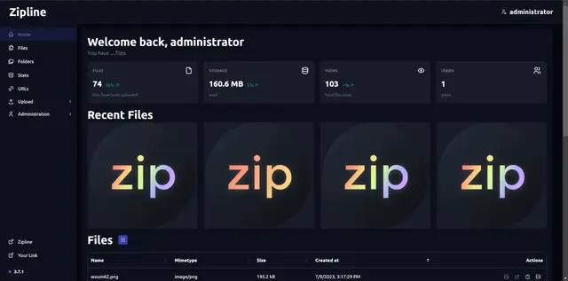
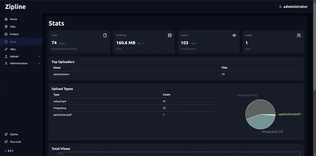

<Badge text="One-click setup." variant="note" size="large" />

## What is Zipline?

The next generation ShareX / File upload server
A ShareX/file upload server that is easy to use, packed with features, and with an easy setup! 

## Screenshots

## Links

- [The official website ›](https://zipline.diced.sh/?utm_source=coolify.io)
- [GitHub ›](https://github.com/diced/zipline?utm_source=coolify.io)

